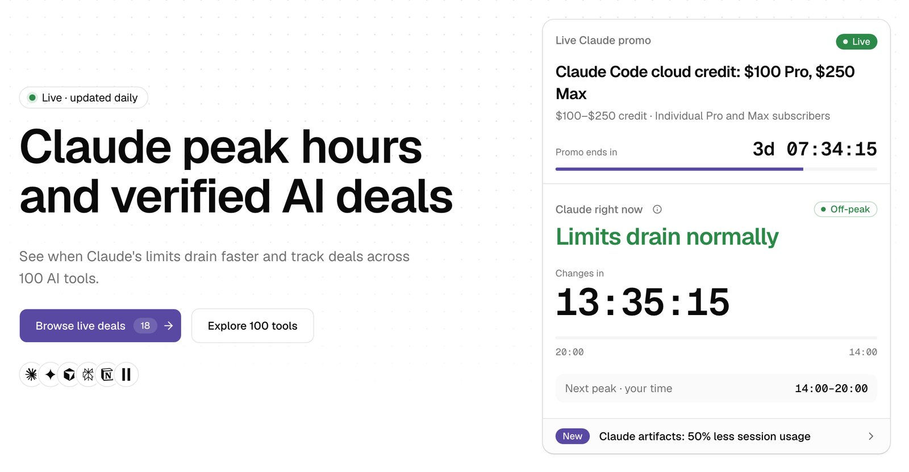

Claude的高峰时段是工作日13:00至19:00 UTC。在这6小时内，Free、Pro、Max和Team套餐的5小时会话额度会比平时消耗得更快，每周额度则保持不变；工作日的傍晚、夜间以及整个周末都是非高峰时段。本文介绍截至2026年10月的规则、9个城市的当地时间，以及围绕高峰时段安排繁重任务的简单方法。

## Claude高峰时段是什么时候？

Claude高峰时段是工作日固定的13:00–19:00 UTC，这段时间里Anthropic会让你的5小时会话额度更快用完。这一时段自2026年3月27日起实行。

- **高峰时段**：周一至周五，13:00–19:00 UTC。
- **非高峰时段**：工作日的其余所有时间，以及整个周六和周日（UTC）。
- **结束日期**：尚未公布。Anthropic没有说明何时、甚至是否会取消这一时段。

我们在PromoClock首页[Claude Watch](/)上实时追踪这一时段。它会显示Claude此刻是否处于高峰时段、按你当地时间显示的高峰时段，以及距下次切换的倒计时。

## 高峰时段里Claude具体有什么变化？

变的只有5小时会话额度的消耗速度：高峰时段内，同样的工作会占用更大比例的会话额度。每周额度、价格和可用模型都不变。

Claude的用量分两层计量。根据[Anthropic的定价页面](https://claude.com/pricing)，每个套餐都有一个按滚动5小时窗口重置的会话额度，付费套餐在此之上还有每周额度。高峰时段只影响第一层。

据[The Register在2026年3月26日的报道](https://www.theregister.com/2026/03/26/anthropic_tweaks_usage_limits/)，Anthropic的Thariq Shihipar在宣布这一变化时表示，每周总额度保持不变，变化的只是额度在一周内的分布。他估计约7%的用户会碰到以前不会碰到的会话额度上限，Pro用户尤其明显。

Anthropic从未公布高峰时段的消耗倍率，也没有公布一次5小时会话包含多少token。网上流传的任何精确“高峰倍率”都只能当作猜测。

## Claude高峰时段从什么时候开始？之后有哪些变化？

Claude高峰时段于2026年3月27日生效，这天也是一项为期两周的非高峰活动的最后一天。此后，Anthropic为Claude Code增加了一项永久豁免，还推出过几次独立的额度提升。

- **2026年3月13日–27日**：[非高峰2倍活动](/deals/claude-march-2026-offpeak-2x/)让Free、Pro、Max和Team在工作日美东时间（ET）08:00–14:00以外的时段和整个周末享有翻倍的会话额度。该活动已结束。
- **2026年3月27日**：[高峰时段正式生效](/deals/claude-peak-hours-introduced/)。此后工作日13:00–19:00 UTC期间，会话额度消耗得更快。
- **2026年5月6日**：根据[官方公告](https://www.anthropic.com/news/higher-limits-spacex)，Anthropic[把Claude Code的5小时额度翻倍，并取消了Pro和Max上Claude Code的高峰时段削减](/deals/claude-code-5h-limits-doubled/)。
- **2026年10月1日–15日**：[Artifact用量活动](/deals/claude-artifact-usage-promo-oct-2026/)期间，在Pro、Max和Team上创建或编辑Artifact之后的10条聊天消息，计入5小时额度的用量减少50%。截至2026年10月4日活动仍在进行，持续到太平洋时间10月15日23:59。

今年其他所有会话额度和每周额度的变化，请看我们的[Claude用量额度指南](/blog/claude-usage-limits/)。

## 哪些Claude套餐受高峰时段影响？

Free、Pro、Max和Team套餐受Claude高峰时段影响，Enterprise套餐不受影响。Pro和Max上的Claude Code享有豁免。

| 套餐 | 聊天、桌面端、移动端和Cowork | Claude Code |
|---|---|---|
| Free | 受影响 | Free套餐不含 |
| Pro | 受影响 | 自2026年5月6日起豁免 |
| Max 5x和Max 20x | 受影响 | 自2026年5月6日起豁免 |
| Team | 受影响 | 未宣布豁免 |
| Enterprise | 不受影响 | 不受影响 |

Claude Code的豁免范围比听上去要窄。在同一个Pro或Max账户上，15:00 UTC进行的长聊天仍会让会话额度消耗得更快，而同一时刻运行的Claude Code则不会。

升级套餐也躲不开高峰时段。根据[Anthropic关于Max套餐的说明](https://support.claude.com/en/articles/11049741-what-is-the-max-plan)，Max 5x（$100/月）和Max 20x（$200/月）每次会话的用量分别是Pro的5倍和20倍，但Max上的聊天照样遵循高峰时段。更大的套餐什么时候值得买，可以看我们的[Claude Pro和Max对比](/blog/claude-pro-vs-max/)；当前价格见[Claude工具页面](/tools/claude/)。

## 我所在时区的Claude高峰时段是几点？

Claude高峰时段为13:00–19:00 UTC，在今年秋天调整时钟之前，对应纽约时间09:00–15:00、伦敦时间14:00–20:00。

| 城市 | 当前（夏令时） | 时钟调整后 |
|---|---|---|
| 纽约 | 09:00–15:00 EDT | 08:00–14:00 EST（11月1日起） |
| 旧金山 | 06:00–12:00 PDT | 05:00–11:00 PST（11月1日起） |
| 伦敦 | 14:00–20:00 BST | 13:00–19:00 GMT（10月25日起） |
| 巴黎/柏林 | 15:00–21:00 CEST | 14:00–20:00 CET（10月25日起） |
| 伊斯坦布尔 | 16:00–22:00 | 不变（UTC+3） |
| 新德里 | 18:30–00:30 IST | 不变 |
| 北京 | 21:00–03:00 CST | 不变 |
| 东京/首尔 | 22:00–04:00 | 不变 |
| 圣保罗 | 10:00–16:00 | 不变（UTC−3） |

欧盟将于2026年10月25日、美国将于2026年11月1日把时钟拨回一小时。UTC时段保持不变，因此这些地区的当地高峰时段会提前一小时。

有两个细节容易让人搞错：

- **深夜时段会跨过午夜**。在新德里、北京、东京和首尔，周五的高峰时段要到当地时间周六凌晨才结束。东京周六00:00–04:00仍属于高峰时段。
- **最初的公告有两种说法**。据The Register报道，公告给出的时段是太平洋时间05:00–11:00和GMT 13:00–19:00。这两种说法只有在加州使用标准时间时才一致；2026年11月1日之前，05:00 PDT对应的是12:00 UTC。我们采用13:00–19:00 UTC。如果你在美国西海岸并想留些余量，可以在11月1日前把05:00–12:00 PDT都当作高峰时段，到那天两种说法会重新对齐。

## 13:00–19:00 UTC这个时段还是官方口径吗？

这一时段在2026年3月正式公布过，但Anthropic现在的帮助中心已不再明确写出。截至2026年10月，我们查看的几篇帮助中心文章（Max套餐、用量最佳实践和用量积分）都只描述了5小时会话和每周额度，没有提到高峰时段。

PromoClock是这样处理这个空白的：

- 我们在时钟、API和本文中继续显示最后一次官方描述的时段，即工作日13:00–19:00 UTC。
- 我们会公开说明它已不再写在帮助中心里，而不是把它当作现行政策原文来呈现。
- 每当额度有变化，我们都会查看Anthropic的帮助中心、博客和员工公告；如果Anthropic宣布新的时段或结束日期，我们会同步更新时钟、API和本文。

我们的[关于页面](/about/)介绍了我们如何核实来源和日期。

## 怎么查看今天Claude是否处于高峰时段？

打开[PromoClock首页](/)：实时时钟会显示Claude今天处于高峰还是非高峰时段、你当地的高峰时间，以及距下次切换的倒计时。开发者还可以用JSON查询同样的状态。



接口是`GET https://promoclock.co/api/status`。它免费、支持CORS，每个IP每分钟最多60次请求，也是PromoClock唯一的公开API。返回内容包括：

- `status`：`peak`或`off_peak`，另有布尔值`isPeak`。
- `nextChange`：下次切换的时间（ISO 8601时间戳），以及`minutesUntilChange`。
- `label`：一行简短易读的状态说明。

```bash
curl -s https://promoclock.co/api/status
```

首页的[开发者工具区](/#developer-tools)提供可直接复制的curl和zsh代码片段，其中一段能在你的命令行提示符里显示红点或绿点。Slack或Discord机器人可以每分钟轮询一次这个接口，在`status`切换时发消息提醒。

根据Anthropic的[用量最佳实践](https://support.claude.com/en/articles/9797557-usage-limit-best-practices)，在Claude中打开Settings > Usage，可以看到你自己的会话额度和每周额度已经用了多少。

## 如何避开Claude高峰时段安排繁重任务？

把最繁重的Claude任务移到工作日13:00–19:00 UTC之外，高峰时段只用来问简短的问题。周末在任何地区都是非高峰时段。

Anthropic列出了哪些因素会让任务变“重”：消息长度、附件大小、对话长度、Research和网页搜索等工具、所选模型、推理强度、Artifact，以及运行代码或浏览网页这类多步骤任务。这些就是该挪走的任务。

按地区来看：

- **美国东海岸**：高峰时段为09:00–15:00 EDT。繁重任务放在09:00前或15:00后开始；从2026年11月1日起，改为08:00 EST前或14:00 EST后。
- **美国西海岸**：高峰时段为06:00–12:00 PDT，下午和晚上都是非高峰时段。
- **欧洲和土耳其**：高峰时段覆盖下午和傍晚。上午最适合处理长文档和Research。
- **印度**：高峰时段为18:30–00:30 IST，整个工作日都是非高峰时段。
- **中国、日本和韩国**：高峰时段落在深夜，整个工作日都是非高峰时段。
- **巴西**：圣保罗的高峰时段为10:00–16:00。清晨和晚上适合做繁重任务。

如果你用的是Pro或Max，高峰时段可以反过来用：跑享有豁免的Claude Code任务，把长聊天留到之后。如果在高峰时段用完了会话额度，等你的5小时窗口重置后，额度就会恢复。

## 总结

Claude高峰时段消耗的是会话额度，从不影响每周额度。我们的建议是：

- **Free或Pro的轻度用户**：基本可以忽略高峰时段。如果在高峰时段用到上限，等5小时额度重置即可。
- **欧洲、土耳其或巴西的重度聊天用户**：在高峰开始前的上午处理长文档和Research。
- **美国用户**：东海岸在清晨、西海岸在下午做大任务，11月1日之后重新核对一遍时间。
- **Pro或Max上的开发者**：高峰时段用来跑Claude Code，长聊天放到非高峰时段。
- **Team管理员**：Anthropic尚未宣布Team享有Claude Code豁免，批量任务请安排在非高峰时段。

开始长时间会话前，先看一眼[Claude Watch](/)。这是了解你当前处境最快的方式。
